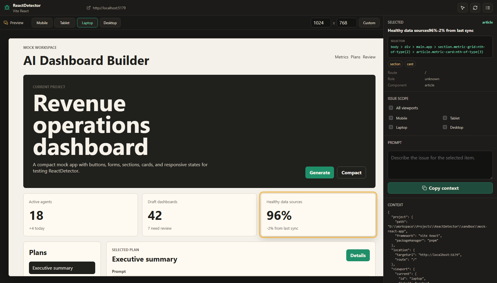

# ReactDetector

ReactDetector is a local CLI inspector for React and Next.js apps. It starts or attaches to a dev server, opens a local browser UI, lets you click visible UI elements, and produces an AI-ready context prompt for Codex, Cursor, ChatGPT, or another assistant.

## Preview



## Install

```bash
pnpm install
pnpm build
```

## Use

Start an existing project with its `dev` script:

```bash
pnpm start -- run D:\path\to\app
```

Attach to an app that is already running:

```bash
pnpm start -- inspect --target-url http://localhost:5173 --project D:\path\to\app
```

Useful options:

```bash
pnpm start -- run ./app --script dev --ui-port 4545 --viewports mobile,desktop
pnpm start -- inspect --target-url http://localhost:3000 --no-open
```

After installing or linking the package as a CLI, use the shorter `reactdetector run ...` and `reactdetector inspect ...` forms.

## Local Mock App

This repo has a mock Vite React app at `sandbox/mock-react-app` for local CLI testing.

```bash
pnpm start -- run .\sandbox\mock-react-app
```

Or start the mock manually, then attach ReactDetector:

```bash
pnpm --dir .\sandbox\mock-react-app run dev
pnpm start -- inspect --target-url http://localhost:5179 --project .\sandbox\mock-react-app
```

## V1 Boundaries

- Supports Next.js and Vite React detection first.
- Does not modify target project source files.
- Adds only temporary runtime `data-rd-id` values inside the browser DOM.
- Produces copyable Markdown plus JSON context instead of calling AI directly.
- Uses runtime DOM/accessibility context and best-effort React fiber hints.

## Verify

```bash
pnpm typecheck
pnpm test
pnpm build
pnpm test:browser
```

`pnpm test:browser` requires Playwright Chromium to be installed:

```bash
pnpm exec playwright install chromium
```

## License

MIT. See `LICENSE`.
